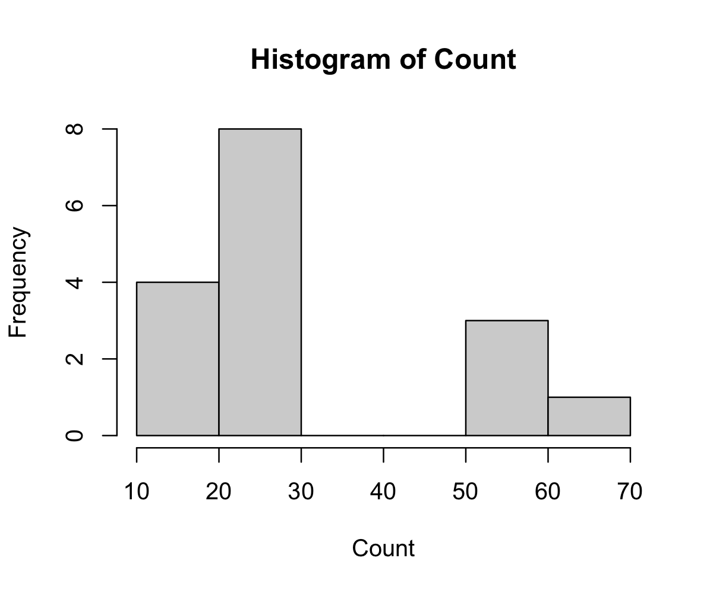

# redo.glm

## Overview

The **redo.glm** package facilitates the setup of an Iteratively Reweighted Least Squares (IRWLS) algorithm to fit specified generalized linear models, focusing on Poisson and Binomial Distributions.

Following model setup, the package enables the evaluation of the fitted model. It provides insights into the model's performance, including (Standardized) Pearson residuals, (Standardized) Deviance residuals, Leverages, and Cook's Distances.

## Installation

To install the **redo.glm** package, use the following commands in R:

```R
# If devtools is not installed, uncomment and run the line below:
# install.packages("devtools")

devtools::install_github("jennie-ui/redo.glm")
```

## Usage

```R
library(redo.glm)
```

### Example: Model Setup

```R
# load data
Cell_Differentiation <- read.csv('data/Cell_Differentiation.csv')

# set up model parameters
glm_full <- glmSetup(res_var = "Count", base_var = "TNF", input_data = Cell_Differentiation, tolerance = 0.00001, log_offset = 0.1, max_iterations = 25)

# Model design matrix
> glm_full$design_matrix
      1 TNF IFN
 [1,] 1   0   0
 [2,] 1   0   4
 [3,] 1   0  20
 [4,] 1   0 100
 [5,] 1   1   0
 [6,] 1   1   4
 [7,] 1   1  20
 [8,] 1   1 100
 [9,] 1  10   0
[10,] 1  10   4
[11,] 1  10  20
[12,] 1  10 100
[13,] 1 100   0
[14,] 1 100   4
[15,] 1 100  20
[16,] 1 100 100
```
Here is the histogram of the response variable under data folder



### Example: Fit a Possion Model

```R
# Variance covariance matrix Var(beta_hat) for beta
> glmPoisson(glm_full)$variance_covariance_matrix
          Intercept    TNF          IFN         
Intercept " 5.791e-03" "-4.545e-05" "-4.063e-05"
TNF       "-4.545e-05" " 9.025e-07" "-1.976e-22"
IFN       "-4.063e-05" "-4.966e-22" " 1.171e-06"

# Estimates
> glmPoisson(glm_full)$estimates
           [,1]
1   2.912658620
TNF 0.010733678
IFN 0.002158749

# standard deviation
> glmPoisson(glm_full)$std
   Intercept          TNF          IFN 
0.0760980220 0.0009500041 0.0010819819 

# confidence interval
> glmPoisson(glm_full)$confidence_interval
        CI_Lower    CI_Upper
1   2.763506e+00 3.061810743
TNF 8.871670e-03 0.012595686
IFN 3.806423e-05 0.004279433

# Pearson Residuals and Deviance Residuals
> glmPoisson(glm_full)$residuals
$pearson
             [,1]
 [1,] -0.32764741
 [2,] -1.29162611
 [3,]  1.09089374
 [4,] -0.17585886
 [5,]  0.55542745
 [6,] -0.40758613
 [7,]  0.58421734
 [8,] -0.64245875
 [9,]  0.33331029
[10,]  0.29278600
[11,] -0.08545684
[12,]  0.50994998
[13,]  0.15801792
[14,] -0.04172029
[15,] -0.56230342
[16,]  0.26752784

$deviance
            [,1]
 [1,]  -6.715024
 [2,] -11.637549
 [3,]  14.794665
 [4,]  -5.943955
 [5,]   9.774061
 [6,]  -7.528076
 [7,]  10.383527
 [8,] -10.850635
 [9,]   7.953693
[10,]   7.471415
[11,]  -3.977258
[12,]  11.773263
[13,]  11.189209
[14,]  -5.708908
[15,] -20.745035
[16,]  17.243201

# Leverage
> glmPoisson(glm_full)$leverage
 [1] 0.10658554 0.10182348 0.08905623 0.21406459
 [5] 0.10606129 0.10123332 0.08826893 0.21429674
 [9] 0.10188405 0.09643690 0.08162823 0.21749870
[13] 0.30825193 0.29429124 0.25681903 0.62179979

# Standardized Pearson and Deviance residuals
> glmPoisson(glm_full)$standardized_residuals
$pearson
             [,1]
 [1,] -0.34664126
 [2,] -1.36287482
 [3,]  1.14297483
 [4,] -0.19836764
 [5,]  0.58745346
 [6,] -0.42992818
 [7,]  0.61184451
 [8,] -0.72479631
 [9,]  0.35170822
[10,]  0.30801443
[11,] -0.08917386
[12,]  0.57648106
[13,]  0.18999071
[14,] -0.04966318
[15,] -0.65226404
[16,]  0.43501887

$deviance
            [,1]
 [1,]  -7.104297
 [2,] -12.279500
 [3,]  15.500987
 [4,]  -6.704742
 [5,]  10.337635
 [6,]  -7.940732
 [7,]  10.874556
 [8,] -12.241253
 [9,]   8.392718
[10,]   7.860020
[11,]  -4.150253
[12,]  13.309273
[13,]  13.453194
[14,]  -6.795796
[15,] -24.063949
[16,]  28.038643

# Cook's Distance
> glmPoisson(glm_full)$cooks_distance
              [,1]
 [1,] 0.0047784229
 [2,] 0.0701902730
 [3,] 0.0425720765
 [4,] 0.0035725507
 [5,] 0.0136481829
 [6,] 0.0069398018
 [7,] 0.0120809753
 [8,] 0.0477603713
 [9,] 0.0046775408
[10,] 0.0033752473
[11,] 0.0002356002
[12,] 0.0307907624
[13,] 0.0053616854
[14,] 0.0003428465
[15,] 0.0490070145
[16,] 0.1037107417

# Scaled deviance and Pearson chi-square statistics to assess the GoF of the model
> glmPoisson(glm_full)$goodness_of_fit
  Deviance chi^2_P chi^2_{n-q(num_predictors),0.95}
1     -233     5.1                             22.4
>
```

### Example: Fit a Binomial Model

```R
# Variance covariance matrix Var(beta_hat) for beta
> glmBinomial(glm_full)$variance_covariance_matrix
          Intercept    TNF          IFN         
Intercept " 2.952e+10" "-2.739e+08" "-2.421e+08"
TNF       "-2.739e+08" " 8.176e+06" " 2.010e-08"
IFN       "-2.421e+08" " 1.899e-08" " 7.810e+06"

# Estimates
> glmBinomial(glm_full)$estimates
             [,1]
1   -3.185847e+01
TNF  5.885919e-01
IFN -3.821694e-17

# standard deviation
> glmBinomial(glm_full)$std
 Intercept        TNF        IFN 
171802.813   2859.350   2794.671 

# confidence interval
> glmBinomial(glm_full)$confidence_interval
       CI_Lower   CI_Upper
1   -336765.372 336701.655
TNF   -5603.738   5604.916
IFN   -5477.555   5477.555

# Pearson Residuals
> glmBinomial(glm_full)$residuals
$pearson
           [,1]
 [1,]  76482880
 [2,]  58486908
 [3,] 107975831
 [4,]  98977845
 [5,]  71177441
 [6,]  57619833
 [7,]  74566843
 [8,]  67788039
 [9,]   5829289
[10,]   5829289
[11,]   5564322
[12,]   7419096
[13,]        54
[14,]        53
[15,]        51
[16,]        68

# Leverage
> glmBinomial(glm_full)$leverage
 [1] 0.001458243 0.001368723 0.001134120 0.002924514
 [5] 0.002522318 0.002364592 0.001951241 0.005105760
 [9] 0.354020466 0.328211927 0.260575756 0.776746537
[13] 0.288225388 0.278979894 0.254750325 0.439660194

# Standardized Pearson residuals
> glmBinomial(glm_full)$standardized_residuals
$pearson
              [,1]
 [1,] 7.653871e+07
 [2,] 5.852698e+07
 [3,] 1.080371e+08
 [4,] 9.912289e+07
 [5,] 7.126738e+07
 [6,] 5.768808e+07
 [7,] 7.463970e+07
 [8,] 6.796176e+07
 [9,] 7.252809e+06
[10,] 7.112127e+06
[11,] 6.470910e+06
[12,] 1.570189e+07
[13,] 6.400627e+01
[14,] 6.241690e+01
[15,] 5.907711e+01
[16,] 9.084127e+01

# Cook's Distance
> glmBinomial(glm_full)$cooks_distance
              [,1]
 [1,] 2.851705e+12
 [2,] 1.564953e+12
 [3,] 4.417499e+12
 [4,] 9.606217e+12
 [5,] 4.281116e+12
 [6,] 2.629271e+12
 [7,] 3.630595e+12
 [8,] 7.901171e+12
 [9,] 9.609501e+12
[10,] 8.237582e+12
[11,] 4.918694e+12
[12,] 2.859326e+14
[13,] 5.529852e+02
[14,] 5.024683e+02
[15,] 3.976768e+02
[16,] 2.158295e+03

# Pearson chi-square statistics to assess the GoF of the model
> glmBinomial(glm_full)$goodness_of_fit
   chi^2_P chi^2_{n-q(num_predictors),0.95}
1 4.94e+16                        -4.94e+16
```

## Documentation

For detailed information on functions and usage, please refer to the [package documentation](https://github.com/jennie-ui/redo.glm/).

## License

This project is licensed under the GNU General Public License - see the [LICENSE.md](LICENSE.md) file for details.
